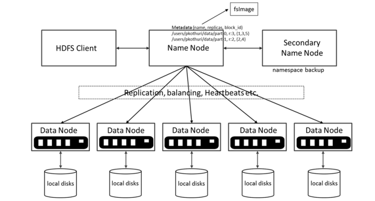
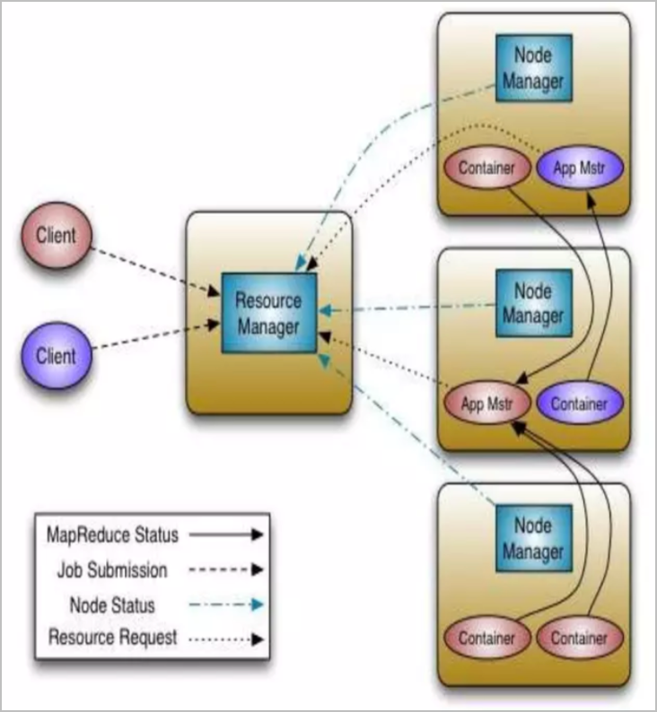
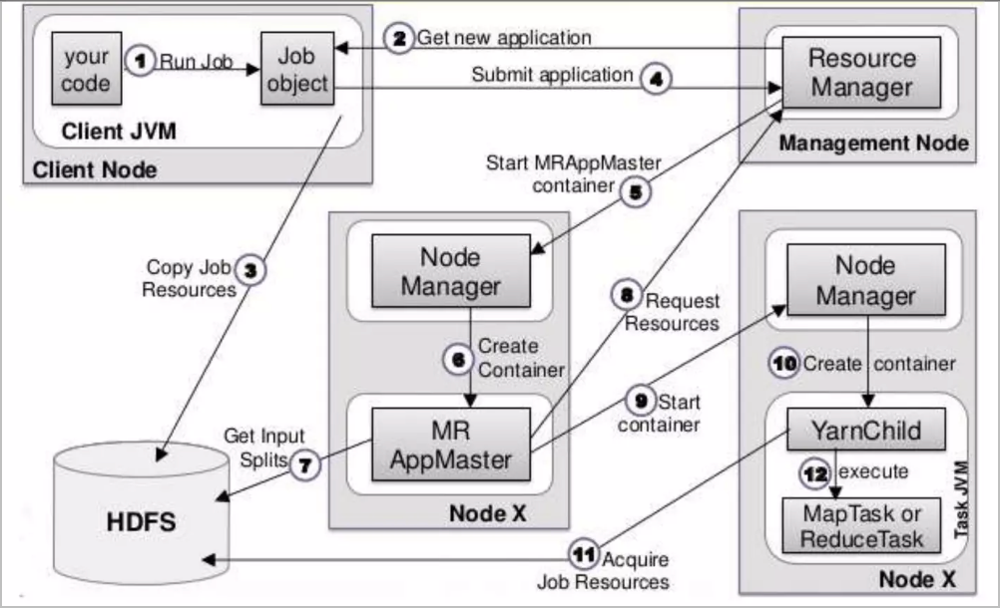
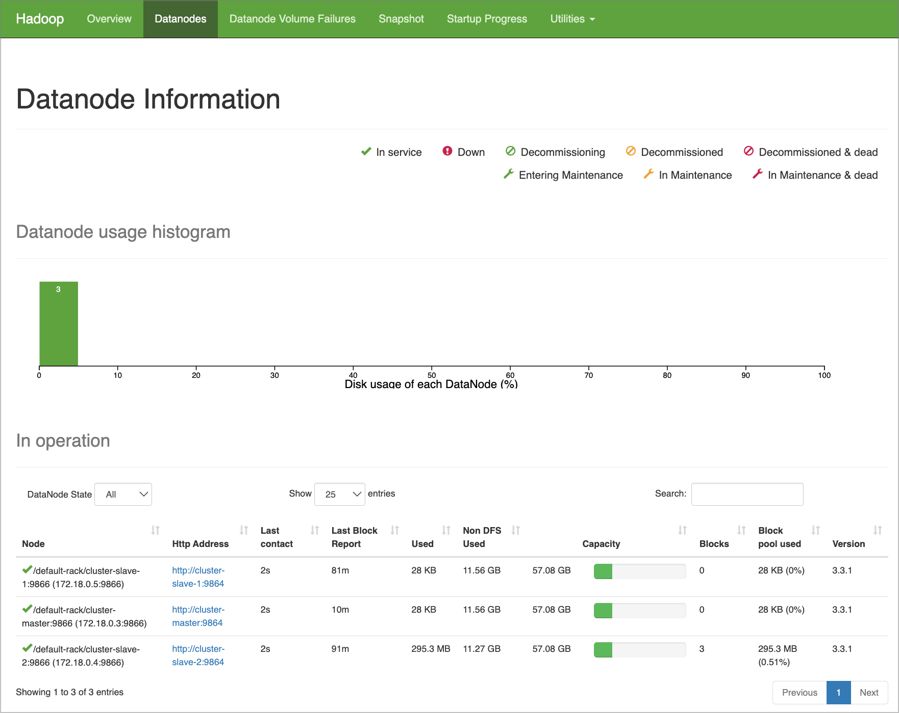
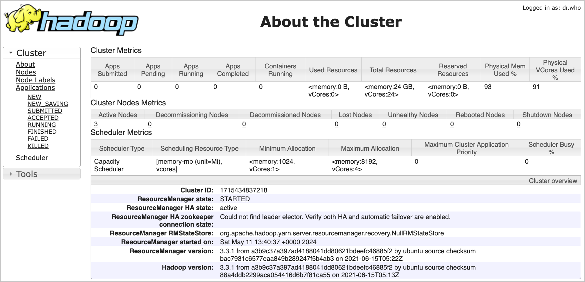
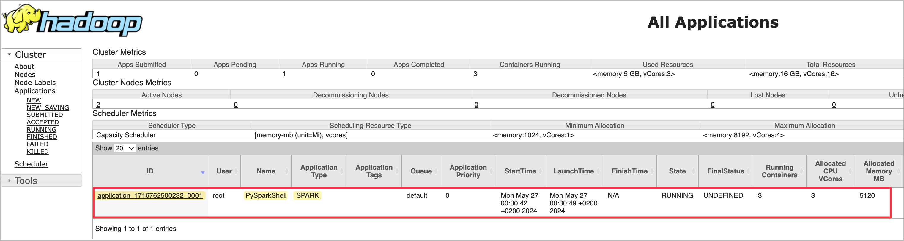

# Hadoop Cluster Deployment and Operations

In this article, we will be deploying Hadoop cluster on our local Docker environment with 1 Master (namenode & datanode) and 2 slave nodes (datanodes only) and perform data operations. We will be storing data into HDFS, and observe its operations on Hadoop UI.

In the world of big data, managing and processing vast amounts of information efficiently has always been a challenge. Traditional systems struggled to keep up with the growing volume, velocity, and variety of data. This is where Hadoop, an open-source framework, revolutionized the landscape of data processing and storage.

## Introduction to Hadoop

### What is Hadoop?

Hadoop is designed to store and process large datasets across clusters of computers using a simple programming model. It is highly scalable, cost-effective, and fault-tolerant, making it ideal for handling big data.

### Why was Hadoop Built?

Before Hadoop, traditional systems struggled with the limitations of single-node processing and storage, leading to issues like high costs, limited scalability, and poor fault tolerance. Hadoop was designed to address these challenges by:

* **Scalability** : Easily adding more nodes to handle increasing data loads.
* **Cost-Effectiveness** : Using commodity hardware to build large clusters.
* **Fault Tolerance** : Ensuring data availability and reliability even if some nodes fail.
* **High Throughput** : Efficiently processing large datasets in parallel.

**Comparing to Legacy Systems**

Traditional data processing systems were often limited by their ability to scale and handle large, diverse datasets efficiently. They typically relied on expensive, high-end hardware and faced significant challenges in terms of fault tolerance and scalability. Hadoop, with its distributed architecture, addressed these limitations by providing a robust, scalable, and cost-effective solution for big data processing.

With Hadoop, data storage and the computation both handled on the nodes which consist the Hadoop cluster.

### How does Hadoop Work?

Hadoop's architecture is built around three main components: HDFS, MapReduce, and YARN.

#### **HDFS (Hadoop Distributed File System)** :

* **Purpose** : HDFS is designed to store large files by distributing them across multiple machines in a cluster.
* **How It Works** : HDFS breaks down a large file into smaller blocks and stores them across different nodes in the cluster. This distribution allows for parallel processing and ensures data availability, even if some nodes fail.
* **Logic** : By spreading the data, HDFS provides high throughput and reliability, addressing the limitations of single-node storage systems.
* **Modules**:

  * **NameNode**: Manages HDFS metadata and namespace. These nodes does not store data, but they actually keep the metadata of the data that is kept in data nodes, such as which data nodes the data is splitted, what is its replication, etc...
  * **DataNode**: Stores actual HDFS data blocks. These are the nodes where the actual data blocks are kept. When user would like to read/write data from/to HDFS, after getting the metadata information from NameNode, client is communicating these nodes for data operations.
  * **Secondary/Standby NameNode**: Periodically saves the merged namespace image to reduce NameNode load and also grant High Availability (HA) for the cluster.

    

    Below is a video by Jesse Anderson where he is explaining how the data is kept as blocks in HDFS.

    <iframe width="560" height="315" src="https://www.youtube.com/embed/4Gfl0WuONMY?si=XMSprT5rtXUxBqpk" title="YouTube video player" frameborder="0" allow="accelerometer; autoplay; clipboard-write; encrypted-media; gyroscope; picture-in-picture; web-share" referrerpolicy="strict-origin-when-cross-origin" allowfullscreen></iframe>

#### **MapReduce** :

* **Purpose** : MapReduce is the core processing engine of Hadoop, designed to process large datasets in parallel.
* **How It Works** : It breaks down a task into two main functions: Map and Reduce.
* **Map Function** : Processes input data and converts it into a set of intermediate key-value pairs.
* **Reduce Function** : Merges these intermediate values to produce the final output.
* **Logic** : This parallel processing model allows Hadoop to handle large-scale data analysis efficiently, overcoming the bottlenecks of traditional sequential processing.

  <iframe width="560" height="315" src="https://www.youtube.com/embed/bcjSe0xCHbE?si=jVlJSxDC7HZPRaDf" title="YouTube video player" frameborder="0" allow="accelerometer; autoplay; clipboard-write; encrypted-media; gyroscope; picture-in-picture; web-share" referrerpolicy="strict-origin-when-cross-origin" allowfullscreen></iframe>

#### **YARN (Yet Another Resource Negotiator)** :

* **Purpose** : YARN manages and allocates resources to various applications running in a Hadoop cluster.
* **How It Works** : It consists of a ResourceManager and NodeManagers. The ResourceManager allocates resources based on the needs of the applications, while NodeManagers monitor resources on individual nodes.
* **Logic** : YARN enhances Hadoop’s scalability and resource utilization, enabling multiple data processing engines to run simultaneously on a single cluster.
* **Modules**:
  * **ResourceManager**: Manages resource allocation in the YARN ecosystem.
  * **NodeManager**: Manages containers and resources on individual nodes in YARN.
  * **ApplicationMaster**: Manages the execution (scheduling and coordination) of a single application in YARN during the application lifecycle and got removed as soon as the application terminates.

    

    Below is the representation of the job submission and its management on YARN

    

### What are the Disadvantages of Hadoop Comparing to Modern Data Systems?

Hadoop was a groundbreaking solution for big data, but modern data systems have emerged with enhancements that address many of its limitations. Here’s a look at some key disadvantages of Hadoop:

* **Complexity in Management and Configuration**: Requires specialized knowledge for setup, configuration, and maintenance, which can be complex and time-consuming.
* **Performance and Latency**: Primarily batch-oriented with high latency in processing large datasets.
* **Resource Efficiency**: Often resource-intensive with significant computational and storage demands.
* **Flexibility and Ecosystem Integration**: Limited flexibility with a strong focus on MapReduce and a more rigid ecosystem.
* **Scalability and Elasticity**: Adding new nodes is not fast or easy, requiring manual intervention and planning.
* **Data Handling and Processing Capabilities**: Computation and storage are tightly coupled, limiting flexibility in resource allocation.

## Deployment of the Cluster

We will deploy the cluster by using the following docker file:

[https://raw.githubusercontent.com/nacisimsek/Data_Engineering/main/Hadoop/docker-compose.yaml](https://raw.githubusercontent.com/nacisimsek/Data_Engineering/main/Hadoop/docker-compose.yaml "[docker-compose.yaml](https://raw.githubusercontent.com/nacisimsek/Data_Engineering/main/Hadoop/docker-compose.yaml)")

> 📝 **Note:**
>
> The image which is being used in this docker-compose file is my [multiarch built version](https://nacisimsek.com/posts/20240421-multiarch-build/ "Build Docker Images with Multiarch Support") of the image which was originally prepared by [Veribilimiokulu](https://hub.docker.com/r/veribilimiokulu/ubuntu_hadoop_hive_sqoop "ubuntu_hadoop_hive_sqoop"). I had attended their [data engineering bootcamp](https://bootcamp.veribilimiokulu.com/bootcamp-programlari/data-engineering-bootcamp/ "VBO-DE-Bootcamp") program and had a chance to learn many new skills around data engineering while also refreshing my existing knowledge. Many of the next blog posts in my website will be related to the hands-on experience I gained during this bootcamp, therefore, special thanks to them for helping us improve ourselves and also encouraging us to share our knowledge to others.

Simply copy the docker compose file and execute below command to deploy the containers.

```powershell
docker-compose up -d
```

This will compose the following four containers:

* cluster-master
* cluster-slave-1
* cluster-slave-2
* postgresql

List the containers and their status with the following command:

```powershell
docker ps --format 'table {{.ID}}\t{{.Names}}\t{{.Status}}'
```

```shell
CONTAINER ID   NAMES                        STATUS
362d93c0d28a   cluster-slave-1              Up About an hour
5e69cc3072aa   cluster-slave-2              Up About an hour
bd3276aa0e7f   cluster-master               Up About an hour
63ea237d5907   postgresql                   Up About an hour
```

After the containers are started, make sure each container has started the above mentioned HDFS and YARN specific modules successfully.

To check this, need to connect the shell of each container:

```powershell
docker exec -it cluster-master bash
```

Then perform below command to see the started modules (services):

```powershell
root@cluster-master:/# jps
455 NameNode
637 Jps
110 GetConf
```

Since this is our master node of YARN and HDFS, and also will be used as one of our data nodes in HDFS and a worker node for YARN, we need to make sure all below modules (services) to be running on it:

* ResourceManager (YARN)
* NodeManager (YARN)
* DataNode (HDFS)

Execute below commands to start these services if they have not been started:

To start NodeManager and ResourceManager:

```powershell
/usr/local/hadoop/sbin/start-yarn.sh
```

To start DataNode:

```powershell
/usr/local/hadoop/sbin/hadoop-daemon.sh start datanode
```

Finally, check if all modules have been started successfully:

```powershell
root@cluster-master:/# jps
903 ResourceManager
455 NameNode
1815 Jps
1560 DataNode
1163 NodeManager
110 GetConf
```

And this is how the slave nodes should look like:

```powershell
root@cluster-slave-1:/# jps
496 DataNode
2017 Jps
1618 NodeManager
837 SecondaryNameNode
```

We should be now accessing to the Hadoop NameNode Web UI (Port 9870) and YARN ResourceManager Web UI (Port 8088)

### Port 9870: Hadoop NameNode Web UI

You can access the namenode web UI from your browser: [http://localhost:9870/](http://localhost:9870/ "http://localhost:9870/")



* **Purpose** :
  * The web interface on port 9870 is the Hadoop NameNode Web UI. It is used for monitoring the HDFS (Hadoop Distributed File System).
* **Functions** :
  * **View HDFS Health** : Provides an overview of the HDFS, including the health and status of the NameNode.
  * **Browse File System** : Allows users to browse the HDFS directories and files.
  * **Check DataNode Status** : Displays the status and details of all DataNodes in the cluster, including storage utilization and block distribution.
  * **Monitor Replication** : Shows information about block replication and under-replicated blocks.
  * **View Logs** : Access NameNode logs for troubleshooting and monitoring.
* **Key Features** :
  * **HDFS Overview** : Presents a summary of the total and available storage.
  * **DataNodes Information** : Details on each DataNode’s storage capacity, usage, and health.
  * **HDFS Metrics** : Metrics on file system operations, such as read and write requests.

> 📝 **Note:**
>
> If you do not see all three nodes listed as Datanode in above list, its most likely the DataNode service is stopped or should be restarted on those nodes. If so, you can connect to the respective container's shell and restart DataNode service as follows:
>
> ```powershell
> docker exec -it <container_name> /bin/bash
> ```
>
> ```powershell
> hdfs --daemon start datanode
> ```

> ❗️ **Important:**
>
> Normally in commercial systems, the master node should not be using as a DataNode, but here in this cluster, for testing purposes, we deployed the master node is also one of the DataNode.

### Port 8088: YARN ResourceManager Web UI

You can access the YARN resource manager web UI from your browser: [http://localhost:8088/](http://localhost:8088/ "http://localhost:8088/")



* **Purpose** :
  * The web interface on port 8088 is the YARN ResourceManager Web UI. It is used for managing and monitoring YARN (Yet Another Resource Negotiator), which handles resource allocation and job scheduling in the Hadoop cluster.
* **Functions** :
  * **Monitor Applications** : Displays the status of running and completed applications (jobs) within the cluster.
  * **View Cluster Metrics** : Provides metrics on resource usage, including memory and CPU utilization across the cluster.
  * **Track Application Logs** : Allows users to access logs for individual applications, aiding in troubleshooting and performance analysis.
  * **Manage Nodes** : Lists all the nodes in the cluster with details about their resource usage and health.
* **Key Features** :
  * **Application Overview** : Summarizes the state, resource usage, and history of applications.
  * **Cluster Utilization** : Shows real-time data on how resources are being utilized across the cluster.
  * **Node Management** : Information on each NodeManager, including available and used resources.

> 📝 **Note:**
>
> If you do not see all three nodes listed as Active Nodes in above page, its most likely the NodeManager service is stopped or should be restarted on those nodes. If so, you can connect to the respective container's shell and restartNodeManager service as follows:
>
> ```powershell
>> docker exec -it cluster-slave-2 /bin/bash
> root@cluster-slave-2:/# jps
> 480 DataNode
> 929 GetConf
> 1416 Jps
> 798 SecondaryNameNode
>
> /usr/local/hadoop/sbin/yarn-daemon.sh start nodemanager
> ```

## Cluster Operations

We will be performing operations on HDFS and YARN to get familiar with them.

### HDFS Operations

1. Download the CSV File to Local, which we will use to import to HDFS:

```powershell
wget https://raw.githubusercontent.com/nacisimsek/Data_Engineering/main/Datasets/Wine.csv
```

2. Put the Downloaded File in HDFS

   a. Copy the File to `cluster-master` Container :

   ```powershell
   docker cp Wine.csv cluster-master:/
   ```

   b. Access the `cluster-master` Container Shell :

   ```powershell
   docker exec -it cluster-master bash
   ```

   c.Create the Directory in HDFS

   ```powershell
   hdfs dfs -mkdir -p /user/root/hdfs_odev
   ```

   d.Copy the File from Container to HDFS

   ```powershell
   hdfs dfs -put Wine.csv /user/root/hdfs_odev/
   ```

   e.Verify the File in HDFS :

   ```powershell
   hdfs dfs -ls /user/root/hdfs_odev
   ```
3. Copy the HDFS File to Another Directory

   a.Create the Target Directory in HDFS

   ```powershell
   hdfs dfs -mkdir -p /tmp/hdfs_odev
   ```

   b.Copy the File within HDFS :

   ```powershell
   hdfs dfs -cp /user/root/hdfs_odev/Wine.csv /tmp/hdfs_odev/
   ```

   c.Verify the Copy in the Target Directory :

   ```powershell
   hdfs dfs -ls /tmp/hdfs_odev
   ```
4. Delete the Directory with Skipping the Trash

   a.Delete the Directory `/tmp/hdfs_odev` :

   ```powershell
   hdfs dfs -rm -r -skipTrash /tmp/hdfs_odev
   ```

   b.Verify Deletion

   ```powershell
   hdfs dfs -ls /tmp
   ```
5. Explore the File in Namenode Web UI

   * **Navigate to Namenode Web UI** :
     * Open your browser and go to `http://localhost:9870`.
     * Go to "Utilities ->> Browse the file system".
     * Navigate to `/user/root/hdfs_odev/Wine.csv`.
   * **Check File Details** :
     * **Size** : Size of the file.
     * **Replication Factor** : Number of replicas.
     * **Block Size** : Size of each block in HDFS.

### YARN Operations

Since the resource manager is running on cluster-master container, we first connect to its shell and initiate spark-shell in yarn mode to observe it as an application submitted.

To do this, first connect to the container shell:

```powershell
docker exec -it cluster-master bash
```

Then initiate pyspark session on yarn:

```powershell
pyspark --master yarn
```

The submitted PySparkShell application can now be observed from the YARN web UI:



This can also be queried from the container shell itself via below command:

```powershell
yarn application -list
```

```
2024-05-26 22:33:24,560 INFO client.DefaultNoHARMFailoverProxyProvider: Connecting to ResourceManager at cluster-master/172.18.0.3:8032
Total number of applications (application-types: [], states: [SUBMITTED, ACCEPTED, RUNNING] and tags: []):1
                Application-Id	    Application-Name	    Application-Type	      User	     Queue	             State	       Final-State	       Progress	                       Tracking-URL
application_1716762500232_0001	        PySparkShell	               SPARK	      root	   default	           RUNNING	         UNDEFINED	            10%	         http://cluster-master:4040
```

You can query the status of this application

```powershell
yarn application -status application_1716762500232_0001
```

```
2024-05-26 22:34:05,252 INFO client.DefaultNoHARMFailoverProxyProvider: Connecting to ResourceManager at cluster-master/172.18.0.3:8032
2024-05-26 22:34:10,228 INFO conf.Configuration: resource-types.xml not found
2024-05-26 22:34:10,238 INFO resource.ResourceUtils: Unable to find 'resource-types.xml'.
Application Report :
	Application-Id : application_1716762500232_0001
	Application-Name : PySparkShell
	Application-Type : SPARK
	User : root
	Queue : default
	Application Priority : 0
	Start-Time : 1716762642037
	Finish-Time : 0
	Progress : 10%
	State : RUNNING
	Final-State : UNDEFINED
	Tracking-URL : http://cluster-master:4040
	RPC Port : -1
	AM Host : 172.18.0.4
	Aggregate Resource Allocation : 756961 MB-seconds, 469 vcore-seconds
	Aggregate Resource Preempted : 0 MB-seconds, 0 vcore-seconds
	Log Aggregation Status : DISABLED
	Diagnostics :
	Unmanaged Application : false
	Application Node Label Expression : `<Not set>`
	AM container Node Label Expression : <DEFAULT_PARTITION>
	TimeoutType : LIFETIME	ExpiryTime : UNLIMITED	RemainingTime : -1seconds
```

That's all for this article. As a summary, we have setup a 3 node Hadoop Cluster on Docker environment and perform sample operations on HDFS and YARN.

Hope you find the article useful. For the next article, we will be performing operations on Hive and MapReduce. Stay tuned.
