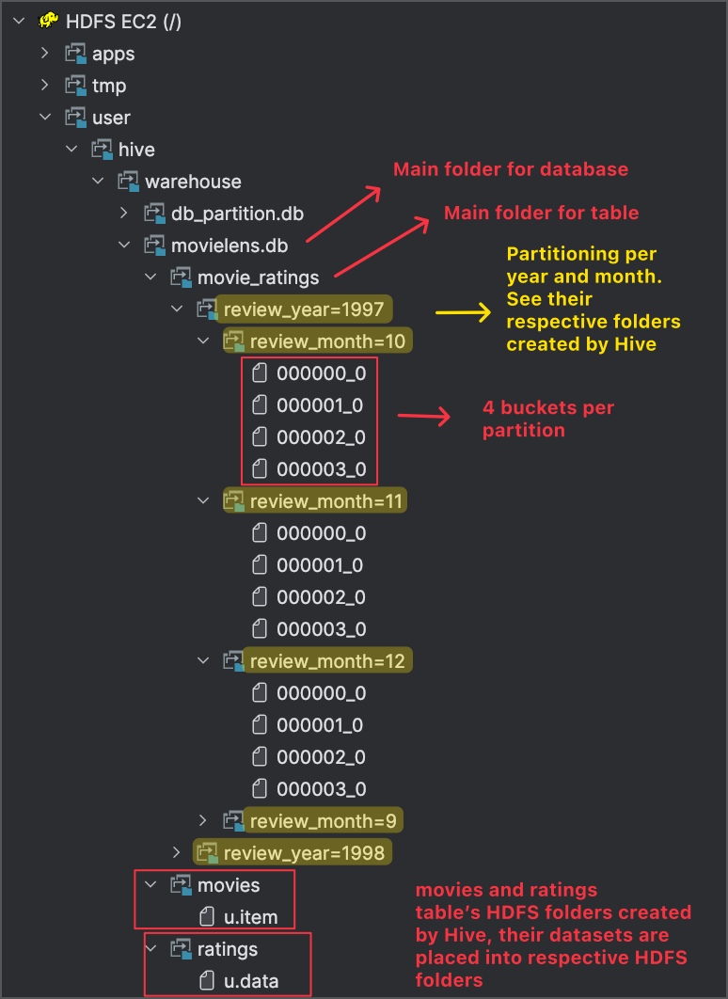
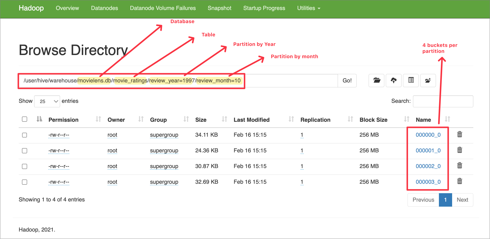

# Hive Partitioning and Bucketing

In the [previous article](https://nacisimsek.com/posts/20240601-hive/ "Hive Setup and Operations"), we created Hive tables and observe data usage on HDFS and metadata management.

In this article, we will be performing partitioning and bucketing options and observe how applying these techniques can help us on query performance.



**Info**: 

If you directly opened this article without setting up your Docker environment, I suggest you visit that [`article`](https://nacisimsek.com/posts/20240509-hadoop-deploy/#deployment-of-the-cluster "Deployment of the Cluster") to deploy your cluster first.



## Data Organization in Hive

There are four main components for organizing data in Hive: `databases`, `tables`, `partitions`, and `buckets`. **Partitions** and **buckets** are key techniques to improve query performance by dividing tables into smaller, manageable pieces.

Think of it this way:

* **Database**: Corresponds to a directory in HDFS.
* **Table**:  Also corresponds to a directory within the database directory in HDFS.
* **Partition**: A subdirectory within the table directory, used to further divide data based on partition keys.
* **Bucket**: File segments within a partition (or table if not partitioned), organizing data within those directories.

Partitioning allows for faster data access by co-locating frequently queried data within the same folders. Bucketing, on the other hand, distributes data into file segments based on a hash of the bucket column, which is beneficial for query and join performance.

Imagine a large retail chain that processes thousands of sales orders every day. To manage this massive flow of data efficiently, the company organizes its orders in two steps:

**1.** **Partitioning by Date:**

Every order is stored in a folder corresponding to the day it was placed. For instance, all orders from September 1, 2023, are stored together, all orders from September 2, 2023, are in another folder, and so on. This means that if you need to retrieve or analyze orders from a particular day, you only need to look at that day's folder rather than the entire dataset.

**2.** **Bucketing by Store Location:**

Within each daily folder, orders are further grouped by the store where they were made. Each store's orders are kept in a separate bucket. So, if the chain has multiple stores (for example, Store A, Store B, Store C), orders from the same store on a specific day will be grouped together. This makes it much faster to run queries that focus on a particular store, such as joining order data with store-specific information.

Here's a simple tree representation to illustrate this:

```apache
Sales Orders Warehouse
├── Date: 2023-09-01
│   ├── Bucket: Store A
│   ├── Bucket: Store B
│   └── Bucket: Store C
├── Date: 2023-09-02
│   ├── Bucket: Store A
│   ├── Bucket: Store B
│   └── Bucket: Store C
└── Date: 2023-09-03
├── Bucket: Store A
├── Bucket: Store B
└── Bucket: Store C
```

In this setup, if you want to analyze orders from September 2, 2023, you directly go to that day's folder. Then, if you're interested in orders from Store B on that day, you only look at the bucket for Store B. This layered organization reduces the amount of data that needs to be scanned and processed, leading to faster query and join performance.



**Tip**:  

Columns chosen for partitioning should generally be those frequently used in `WHERE` clauses for filtering data, and should have low cardinality to avoid creating too many small partitions, which can hurt performance. Avoid partitioning by unique IDs like user IDs or phone numbers.





**Tip**: 

Bucketing is especially effective when the bucketed column is used in `GROUP BY` or `SORT BY` clauses in your queries, as it can optimize these operations significantly. Aim for a bucket size that is a multiple of the HDFS block size or around 1GB, using the formula: `Table size / Number of buckets >= HDFS block size` or `table size / 1 GB`.



## Partitioning Operations

Partitioning in Hive involves dividing a table into smaller parts based on the values of one or more partition keys. This allows Hive to retrieve only the relevant partitions during a query, significantly reducing the amount of data scanned and improving query performance.

### Creating a Partitioned Table

Let's look at an example of creating a partitioned table. In this case, we'll partition a sales table by `sales_date`.

Note: Prior to this below step, I am assuming you have already done the steps on this blog post till this given step. Therefore you have a ready Hive service running on your Hadoop cluster, to be able to perform the following steps.




**Note**:

Prior to this below step, I am assuming you have already done all the steps prior to [`this given step`](https://nacisimsek.com/posts/20240601-hive/#create-hive-database-and-the-table "Create Hive Database and the Table") of this blog post. Therefore you have a ready Hive service running on your Hadoop cluster, to be able to perform the following steps.



```sql
create database db_partition;
```

```sql
CREATE TABLE IF NOT EXISTS db_partition.sales_partitioned_by_date (
    sales_id      INT,
    country       STRING,
    product_id    INT,
    product_name  STRING,
    quantity      INT,
    unit_price    FLOAT
)
PARTITIONED BY (sales_date DATE)
ROW FORMAT DELIMITED 
    FIELDS TERMINATED BY ','
    LINES TERMINATED BY '\n'
STORED AS ORC;
```



**Tip**: Notice that the partition column (`sales_date` in this example) is defined separately in the `PARTITIONED BY` clause and is **not** included in the column definitions within the parentheses before it.



### Static and Dynamic Partitioning

Hive supports two main types of partitioning: static and dynamic.

* **Static Partitioning**: In static partitioning, you manually create each partition and explicitly specify the partition when loading data. This is suitable when you know the partition values beforehand.
* **Dynamic Partitioning**: Hive automatically creates partitions based on the data being inserted.  The `CREATE TABLE` syntax is the same as for static partitioning. To enable dynamic partitioning, you need to set the following properties:

```sql
set hive.exec.dynamic.partition=true;
set hive.exec.dynamic.partition.mode=nonstrict;
```

When dynamic partitioning is enabled, Hive will automatically infer and create new partitions as new partition key values are encountered during data loading.



**Tip**: 

When using dynamic partitioning, ensure that the partition column(s) are placed **last** in the `INSERT` statement's `SELECT` clause or `VALUES` clause.



#### When to use which?

* **Static Partitioning**: Best used when you have a well-defined and relatively small number of partitions, and when data loading processes are predictable. It requires more upfront setup but can be more performant if partitions are well-managed.
* **Dynamic Partitioning**:  More flexible and less development effort, especially when dealing with data where partition values are not known in advance or are numerous. However, dynamic partitioning can be slower than static partitioning, and there are limits to the number of dynamic partitions that can be created (default is 100 per node). Exceeding this limit will result in an error.

### Insert Data into Partitioned Table

Let's see how to insert data into a dynamically partitioned table. Key points to remember:

1. Use the `INSERT INTO table PARTITION (partition_column)` syntax.
2. Ensure partition column values are provided last in the `VALUES` clause.INSERT INTO db_partition.sales_partitioned_by_date PARTITION (sales_date)

```sql
VALUES 
(100001, 'UK', 2134562, 'Electric Guitar', 2, 2599.99, '2020-04-20'),
(100002, 'USA', 2134563, 'Acoustic Guitar', 1, 1599.99, '2020-02-19'),
(100003, 'USA', 2134563, 'Acoustic Guitar', 2, 1599.99, '2020-02-19'),
(100004, 'TR', 2134563, 'Bass Guitar', 1, 1199.99, '2020-03-19'),
(100005, 'FR', 2133563, 'Drum Set', 1, 899.99, '2020-04-11'),
(100006, 'UK', 2134563, 'Keyboard', 1, 1359.99, '2020-04-14'),
(100007, 'USA', 2134513, 'Electric Bass', 1, 699.99, '2020-04-20'),
(100008, 'TR', 2134560, 'Synthesizer', 1, 1489.99, '2020-03-19'),
(100009, 'UK', 2134569, 'Violin', 1, 465.00, '2020-04-11'),
(100010, 'FR', 2134562, 'Piano', 1, 895.99, '2020-04-14');
```

```sql
select count(1) from db_partition.sales_partitioned_by_date;
```

```
+------+
| _c0  |
+------+
| 10   |
+------+
```

### List Partitions and Query Data

You can list the partitions of a Hive table in a few ways. One method is to directly look at the HDFS directory structure:

```powershell
hdfs dfs -ls /user/hive/warehouse/db_partition.db/sales_partitioned_by_date
```

```
Found 5 items
drwxr-xr-x   - root supergroup          0 2025-02-16 12:26 /user/hive/warehouse/db_partition.db/sales_partitioned_by_date/sales_date=2020-02-19
drwxr-xr-x   - root supergroup          0 2025-02-16 12:26 /user/hive/warehouse/db_partition.db/sales_partitioned_by_date/sales_date=2020-03-19
drwxr-xr-x   - root supergroup          0 2025-02-16 12:26 /user/hive/warehouse/db_partition.db/sales_partitioned_by_date/sales_date=2020-04-11
drwxr-xr-x   - root supergroup          0 2025-02-16 12:26 /user/hive/warehouse/db_partition.db/sales_partitioned_by_date/sales_date=2020-04-14
drwxr-xr-x   - root supergroup          0 2025-02-16 12:26 /user/hive/warehouse/db_partition.db/sales_partitioned_by_date/sales_date=2020-04-20
```

Alternatively, you can use the Hive CLI command:

```sql
SHOW partitions db_partition.sales_partitioned_by_date;
```

```
+------------------------+
|       partition        |
+------------------------+
| sales_date=2020-02-19  |
| sales_date=2020-03-19  |
| sales_date=2020-04-11  |
| sales_date=2020-04-14  |
| sales_date=2020-04-20  |
+------------------------+
```

To query data from a specific partition, you can include a `WHERE` clause that filters on the partition column:

```sql
SELECT * FROM db_partition.sales_partitioned_by_date WHERE sales_date = '2020-04-11' LIMIT 10;
```

```
+-------------------------------------+------------------------------------+---------------------------------------+-----------------------------------------+-------------------------------------+---------------------------------------+---------------------------------------+
| sales_partitioned_by_date.sales_id  | sales_partitioned_by_date.country  | sales_partitioned_by_date.product_id  | sales_partitioned_by_date.product_name  | sales_partitioned_by_date.quantity  | sales_partitioned_by_date.unit_price  | sales_partitioned_by_date.sales_date  |
+-------------------------------------+------------------------------------+---------------------------------------+-----------------------------------------+-------------------------------------+---------------------------------------+---------------------------------------+
| 100005                              | FR                                 | 2133563                               | Drum Set                                | 1                                   | 899.99                                | 2020-04-11                            |
| 100009                              | UK                                 | 2134569                               | Violin                                  | 1                                   | 465.0                                 | 2020-04-11                            |
+-------------------------------------+------------------------------------+---------------------------------------+-----------------------------------------+-------------------------------------+---------------------------------------+---------------------------------------+
```

## Bucketing

Bucketing is another data organization technique in Hive. While partitioning divides data into different directories, bucketing further divides data within partitions (or within a table if it's not partitioned) into multiple files called buckets.

Bucketing is beneficial for:

* **Improved query performance**:  Especially for queries involving joins and sampling.
* **Data organization**:  Data is pre-sorted and organized within each bucket.

To use bucketing, you must specify the number of buckets when creating the table and enable bucketing enforcement:

```sql
set hive.enforce.bucketing = true;
```

This setting ensures that Hive respects bucketing when writing data into the table.

## Partitioning + Bucketing Example

Let's dive into a practical example that demonstrates the combined power of partitioning and bucketing. In this example, we will use the MovieLens dataset to analyze movie ratings. Our business needs require us to efficiently query the most popular movies of a month with the lowest possible latency. To achieve this, we will create a Hive table that is both partitioned and bucketed.

### Download Datasets

First, we need to download the MovieLens datasets (`u.data` and `u.item`) from the provided URL using `wget` command into our `cluster-master` container shell where we run the Hive services from:

Make sure you download it to the folder where you map the docker volume (`usr/local/hadoop/namenode/`), if you would like to access the dataset even the container gets restarted.

```powershell
root@cluster-master:/# cd usr/local/hadoop/namenode/
```

```powershell
mkdir hive_datasets
```

```powershell
cd hive_datasets/
```

```powershell
wget -O u.item https://raw.githubusercontent.com/nacisimsek/Data_Engineering/refs/heads/main/Datasets/u.item
wget -O u.data https://raw.githubusercontent.com/nacisimsek/Data_Engineering/refs/heads/main/Datasets/u.data
```

To understand the structure and delimiters of these datasets, we can use the `head` command:

```powershell
root@cluster-master:/usr/local/hadoop/namenode/hive_datasets# head u.item
```

```
movieid|movietitle|releasedate|videoreleasedate|IMDbURL|unknown|Action|Adventure|Animation|Children's|Comedy|Crime|Documentary|Drama|Fantasy|Film-Noir|Horror|Musical|Mystery|Romance|Sci-Fi|Thriller|War|Western
1|ToyStory(1995)|01-Jan-1995||http://us.imdb.com/M/title-exact?Toy%20Story%20(1995)|0|0|0|1|1|1|0|0|0|0|0|0|0|0|0|0|0|0|0
2|GoldenEye(1995)|01-Jan-1995||http://us.imdb.com/M/title-exact?GoldenEye%20(1995)|0|1|1|0|0|0|0|0|0|0|0|0|0|0|0|0|1|0|0
3|FourRooms(1995)|01-Jan-1995||http://us.imdb.com/M/title-exact?Four%20Rooms%20(1995)|0|0|0|0|0|0|0|0|0|0|0|0|0|0|0|0|1|0|0
4|GetShorty(1995)|01-Jan-1995||http://us.imdb.com/M/title-exact?Get%20Shorty%20(1995)|0|1|0|0|0|1|0|0|1|0|0|0|0|0|0|0|0|0|0
5|Copycat(1995)|01-Jan-1995||http://us.imdb.com/M/title-exact?Copycat%20(1995)|0|0|0|0|0|0|1|0|1|0|0|0|0|0|0|0|1|0|0
...
```

```powershell
root@cluster-master:/usr/local/hadoop/namenode/hive_datasets# head u.data
```

```
user_id	item_id	rating	timestamp
196	242	3	881250949
186	302	3	891717742
22	377	1	878887116
244	51	2	880606923
166	346	1	886397596
298	474	4	884182806
...
```

Now, let's proceed to load these datasets into Hive tables. Start by launching the Beeline client and creating a database named `movies`:

```sql
create database if not exists movielens;
```

### Load Data into Respective Hive Tables

First, we will load the `u.data` dataset into a Hive table named `ratings`.

#### Create Hive DB/Table and Load Data

To load the ratings data, we first create an external table `movielens.ratings` matching the structure of `u.data`.  Note that the delimiter is tab (`\t`) and we skip the header line.

```sql
CREATE TABLE IF NOT EXISTS movielens.ratings (
    user_id     INT,
    item_id     INT,
    rating      INT,
    rating_time BIGINT
)
ROW FORMAT DELIMITED
    FIELDS TERMINATED BY '\t'
    LINES TERMINATED BY '\n'
STORED AS TEXTFILE
TBLPROPERTIES ('skip.header.line.count'='1');
```

Then, load the data from the local file system into the `movielens.ratings` table:

```sql
load data local inpath '/usr/local/hadoop/namenode/hive_datasets/u.data' into table movielens.ratings;
```

Verify the data load by selecting a few rows and checking the total row count and distinct user count:

```sql
select * from movielens.ratings limit 4;
```

```
+------------------+------------------+-----------------+----------------------+
| ratings.user_id  | ratings.item_id  | ratings.rating  | ratings.rating_time  |
+------------------+------------------+-----------------+----------------------+
| 196              | 242              | 3               | 881250949            |
| 186              | 302              | 3               | 891717742            |
| 22               | 377              | 1               | 878887116            |
| 244              | 51               | 2               | 880606923            |
+------------------+------------------+-----------------+----------------------+
```

```sql
select count(1) from movielens.ratings;
```

```
+---------+
|   _c0   |
+---------+
| 100000  |
+---------+
```

```sql
select count(distinct user_id) from movielens.ratings;
```

```
+------+
| _c0  |
+------+
| 943  |
+------+
```

Next, load the `u.item` dataset into a Hive table named `movies`.

Create the `movies` table in the `movielens` database, matching the structure of `u.item`. Note that the delimiter is pipe (`|`) and we skip the header line.

```sql
create table if not exists  movielens.movies (
    movieid int,
    movietitle string,
    releasedate string,
    videoreleasedate string,
    IMDbURL string,
    unknown tinyint,
    Action tinyint,
    Adventure tinyint,
    Animation tinyint,
    Childrens tinyint,
    Comedy tinyint,
    Crime tinyint,
    Documentary tinyint,
    Drama tinyint,
    Fantasy tinyint,
    FilmNoir tinyint,
    Horror tinyint,
    Musical tinyint,
    Mystery tinyint,
    Romance tinyint,
    SciFi tinyint,
    Thriller tinyint,
    War tinyint,
    Western  tinyint)
    row format delimited
fields terminated by '|'
lines terminated by '\n'
stored as textfile
tblproperties('skip.header.line.count'='1');
```

Load data from the local file system into the `movielens.movies` table:

```sql
load data local inpath '/usr/local/hadoop/namenode/hive_datasets/u.item' into table movielens.movies;
```

Verify the data load by selecting a few rows and checking the total row count:

```sql
select movieid, movietitle, releasedate, imdburl from movielens.movies limit 5;
```

```
+----------+------------------+--------------+----------------------------------------------------+
| movieid  |    movietitle    | releasedate  |                      imdburl                       |
+----------+------------------+--------------+----------------------------------------------------+
| 1        | ToyStory(1995)   | 01-Jan-1995  | http://us.imdb.com/M/title-exact?Toy%20Story%20(1995) |
| 2        | GoldenEye(1995)  | 01-Jan-1995  | http://us.imdb.com/M/title-exact?GoldenEye%20(1995) |
| 3        | FourRooms(1995)  | 01-Jan-1995  | http://us.imdb.com/M/title-exact?Four%20Rooms%20(1995) |
| 4        | GetShorty(1995)  | 01-Jan-1995  | http://us.imdb.com/M/title-exact?Get%20Shorty%20(1995) |
| 5        | Copycat(1995)    | 01-Jan-1995  | http://us.imdb.com/M/title-exact?Copycat%20(1995)  |
+----------+------------------+--------------+----------------------------------------------------+
5 rows selected (0.189 seconds)
```

```sql
select count(1) from movielens.movies;
```

```
+-------+
|  _c0  |
+-------+
| 1682  |
+-------+
```

Now that we have both `ratings` and `movies` data loaded into Hive, we can create our partitioned and bucketed table.

### Create Partitioned and Bucketed Hive Table

To efficiently query popular movies by month, create the `movielens.movie_ratings` table partitioned by `review_year` and `review_month`, and bucketed by `movietitle`:

```sql
CREATE TABLE IF NOT EXISTS movielens.movie_ratings (
    user_id            INT,
    rating             INT,
    rating_time        BIGINT,
    movieid            INT,
    movietitle         STRING,
    videoreleasedate   STRING,
    imdburl            STRING
)
PARTITIONED BY (
    review_year INT,
    review_month INT
)
CLUSTERED BY (movietitle) INTO 4 BUCKETS
STORED AS ORC;
```

Enable dynamic partitioning and bucketing for the data loading process:

```sql
set hive.exec.dynamic.partition=true;
set hive.exec.dynamic.partition.mode=nonstrict;
set hive.enforce.bucketing=true;
```

### Load Data into Partitioned & Bucketed Table by Joining Existing Hive Tables

Load data into the `movielens.movie_ratings` table by joining `movielens.ratings` and `movielens.movies` tables. The data will be dynamically partitioned by `review_year` and `review_month`:

```sql
insert overwrite table movielens.movie_ratings PARTITION(review_year, review_month)
select
    r.user_id,
    r.rating,
    r.rating_time,
    m.movieid,
    m.movietitle,
    m.videoreleasedate,
    m.imdburl,
    YEAR(from_unixtime(r.rating_time, 'yyyy-MM-dd')) as review_year,
    MONTH(from_unixtime(r.rating_time, 'yyyy-MM-dd')) as review_month
from movielens.ratings r join movielens.movies m on r.item_id = m.movieid;
```

### Perform Checks and Queries on Partitioned & Bucketed Final Hive Table

Verify the data loading and partitioning by checking the row count and listing partitions:

```sql
select count(1) from movielens.movie_ratings;
```


```
+---------+
|   _c0   |
+---------+
| 100000  |
+---------+
```

We can describe our table to see its fields, their data type, and see if there is partitioning in place, and if yes, on which columns the partitioning is performed:

```sql
describe movielens.movie_ratings;
```


```
+--------------------------+------------+----------+
|         col_name         | data_type  | comment  |
+--------------------------+------------+----------+
| user_id                  | int        |          |
| rating                   | int        |          |
| rating_time              | bigint     |          |
| movieid                  | int        |          |
| movietitle               | string     |          |
| videoreleasedate         | string     |          |
| imdburl                  | string     |          |
| review_year              | int        |          |
| review_month             | int        |          |
|                          | NULL       | NULL     |
| # Partition Information  | NULL       | NULL     |
| # col_name               | data_type  | comment  |
| review_year              | int        |          |
| review_month             | int        |          |
+--------------------------+------------+----------+
14 rows selected (0.113 seconds)
```

We can list the created partitions, which are basically different folder structure Hive generates on HDFS:

```sql
show partitions movielens.movie_ratings;
```

```
+-----------------------------------+
|             partition             |
+-----------------------------------+
| review_year=1997/review_month=10  |
| review_year=1997/review_month=11  |
| review_year=1997/review_month=12  |
| review_year=1997/review_month=9   |
| review_year=1998/review_month=1   |
| review_year=1998/review_month=2   |
| review_year=1998/review_month=3   |
| review_year=1998/review_month=4   |
+-----------------------------------+
```

It is always nice to use third party tools to access quick visualization of your underlying servers. This time, I will view the partitioning folder structure of our table from Big Data Plugin of Intellij where I connected to the underlying **HDFS** to see the partitioning folders created by **Hive**:



Same can also be viewed on the Namenode UI's Browse Directory menu where you can browse the HDFS:



We can see the partitioning works correctly by performing distinct query on `review_year` and `review_month` fields of our `movielens.movie_ratings` table:

```sql
select distinct (review_year, review_month) from movielens.movie_ratings;
```

```
+--------------------------+
|           _c0            |
+--------------------------+
| {"col1":1997,"col2":9}   |
| {"col1":1997,"col2":10}  |
| {"col1":1997,"col2":11}  |
| {"col1":1997,"col2":12}  |
| {"col1":1998,"col2":1}   |
| {"col1":1998,"col2":2}   |
| {"col1":1998,"col2":3}   |
| {"col1":1998,"col2":4}   |
+--------------------------+
8 rows selected (32.082 seconds)
```

Now, let's run queries to find the top rated movies in April 1998.

#### Top rated counts movies in April 1998

Find the top 20 most rated movies in April 1998:

```sql
SELECT
    COUNT(*) AS total_count,
    movietitle
FROM
    movielens.movie_ratings
WHERE
    review_year = 1998
    AND review_month = 4
GROUP BY
    movietitle
ORDER BY
    total_count DESC
LIMIT 20;
```

```
+--------------+------------------------------+
| total_count  |          movietitle          |
+--------------+------------------------------+
| 63           | Titanic(1997)                |
| 52           | AirForceOne(1997)            |
| 50           | Contact(1997)                |
| 49           | FullMonty,The(1997)          |
| 49           | StarWars(1977)               |
| 42           | GoodWillHunting(1997)        |
| 41           | LiarLiar(1997)               |
| 41           | EnglishPatient,The(1996)     |
| 39           | AsGoodAsItGets(1997)         |
| 39           | ConspiracyTheory(1997)       |
| 37           | Scream(1996)                 |
| 36           | ToyStory(1995)               |
| 36           | Fargo(1996)                  |
| 36           | ReturnoftheJedi(1983)        |
| 35           | L.A.Confidential(1997)       |
| 34           | ChasingAmy(1997)             |
| 34           | Godfather,The(1972)          |
| 33           | Braveheart(1995)             |
| 33           | StarshipTroopers(1997)       |
| 33           | SilenceoftheLambs,The(1991)  |
+--------------+------------------------------+
```

#### Top average rated movies in April 1998

Find the top 20 highest average rated movies in April 1998:

```sql
SELECT
    AVG(rating) AS avg_rating,
    COUNT(*) AS total_count,
    movietitle
FROM
    movielens.movie_ratings
WHERE
    review_year = 1998
    AND review_month = 4
GROUP BY
    movietitle
ORDER BY
    avg_rating DESC
LIMIT 20;
```

```
+-------------+--------------+-------------------------------------------+
| avg_rating  | total_count  |                movietitle                 |
+-------------+--------------+-------------------------------------------+
| 5.0         | 3            | CelluloidCloset,The(1995)                 |
| 5.0         | 1            | Boys,Les(1997)                            |
| 5.0         | 1            | Flirt(1995)                               |
| 5.0         | 1            | FreeWilly2:TheAdventureHome(1995)         |
| 5.0         | 1            | DeltaofVenus(1994)                        |
| 5.0         | 1            | CutthroatIsland(1995)                     |
| 5.0         | 1            | DunstonChecksIn(1996)                     |
| 5.0         | 2            | Diexueshuangxiong(Killer,The)(1989)       |
| 5.0         | 1            | Lassie(1994)                              |
| 5.0         | 1            | Innocents,The(1961)                       |
| 5.0         | 1            | Stalingrad(1993)                          |
| 5.0         | 1            | FearofaBlackHat(1993)                     |
| 5.0         | 1            | Trust(1990)                               |
| 5.0         | 1            | BoxingHelena(1993)                        |
| 5.0         | 1            | DavyCrockett,KingoftheWildFrontier(1955)  |
| 5.0         | 1            | BitterSugar(AzucarAmargo)(1996)           |
| 5.0         | 1            | BlueSky(1994)                             |
| 5.0         | 1            | Daylight(1996)                            |
| 5.0         | 2            | Prefontaine(1997)                         |
| 5.0         | 1            | 8Seconds(1994)                            |
+-------------+--------------+-------------------------------------------+
```

These queries demonstrate how partitioning by year and month and bucketing by movie title can help optimize data retrieval and analysis for time-based and movie-centric queries for low latency access to popular movie data.
