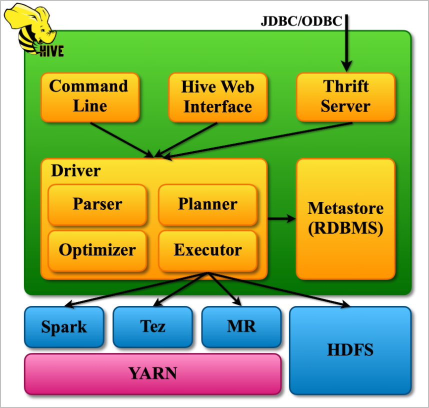
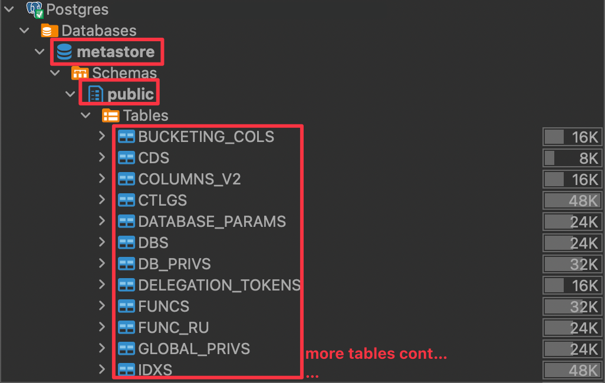
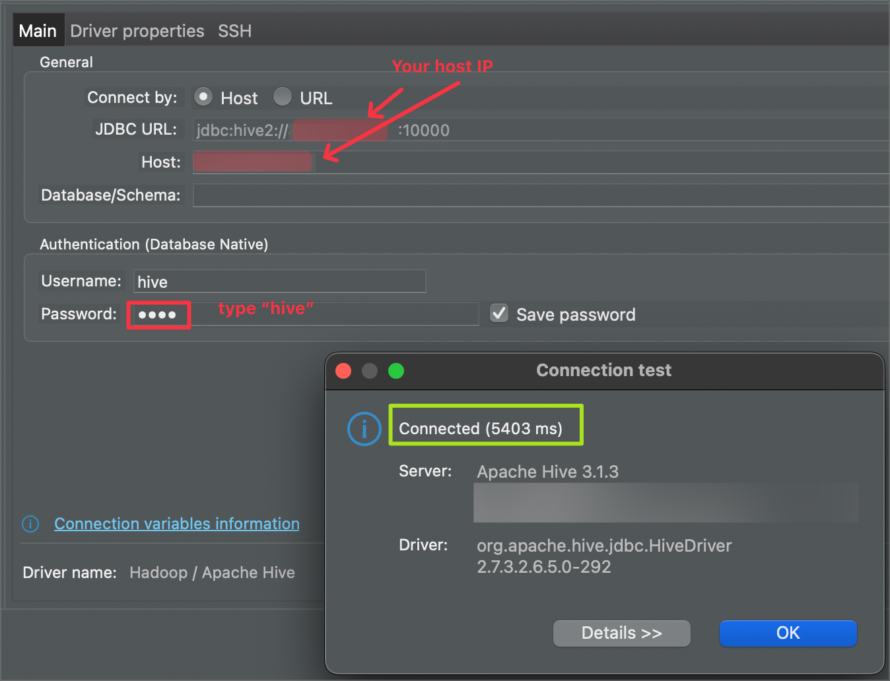

# Hive Deployment and Operations

In the [previous article](https://nacisimsek.com/posts/20240509-hadoop-deploy/ "Deploy Hadoop Cluster"), we deployed our Hadoop cluster on docker, accessed both HDFS and YARN UIs, and performed some simple file operations on HDFS.

In this article, we will deploy Hive services on the same Hadoop cluster and perform various operations on it to learn its basics, usage, and advantages for our data operations. If you directly opened this article without setting up your Docker environment, I suggest you visit that [article](https://nacisimsek.com/posts/20240509-hadoop-deploy/#deployment-of-the-cluster "Deployment of the Cluster") to deploy your cluster first.

> ❗️ **Important:**
>
> Since the image used in this experiment is built with the needed Hive services included, we can run Hive services in this cluster. However, if you are working on your own cluster built on top of a different image, the operations/commands used in this article may not be compatible with your environment.

## Introduction to Hive

Welcome to the world of Hive! If you're new to this tool, don't worry—by the end of this post, you'll clearly understand what Hive is, why it was created, and how it works. Let's get started!

### What is Hive?

Hive is like a friendly translator that helps you talk to your big data. Imagine you have a massive library filled with books (data), but they're all written in different languages. You want to ask questions about the books but don't speak those languages. Hive steps in to help! It allows you to use SQL (Structured Query Language), which is a common language for databases, to interact with your data stored in Hadoop, a framework for storing and processing large data sets.

- It allows querying the data stored on HDFS with a SQL-like language.
- Created by Facebook. Handed over Apache community.
- It processes structured data that can be stored in a table.
- The mode in which it works is batch processing, not real-time (streaming data).
- It uses engines like MapReduce, Tez, or Spark.
- It supports many different file formats: Parquet, Sequence, ORC, Text, etc.

> ❗️ **Important:**
>
> * Hive is not a database.
> * It is unsuitable for operational database needs (OLTP) since it focuses on heavy analytics queries.
> * It is unsuitable for operational database needs (OLTP) for row-based insert, update, and delete or interactive queries.
> * The query takes a reasonable amount of time. Converts query to MapReduce/Tez code gets resources from YARN and starts the operation.
> * HiveQL is not standard SQL. Should not expect everything as in SQL.

### Why was Hive Built?

In the early days of Hadoop, data analysts and scientists had to write complex and lengthy MapReduce Java programs to analyze data. This was time-consuming, error-prone, and required a deep understanding of programming languages like Java or Python. Hive was built to simplify this process. It provides a familiar SQL-like interface that allows users to query and analyze data without writing complex code. This makes it easier for data analysts, scientists, and even business users to work with Big Data without requiring extensive programming knowledge.

### How does Hive Work?

Hive works by converting your SQL queries into a series of MapReduce jobs that run on Hadoop. Let’s break this down with a simple example: Imagine you run a bookstore and have a massive spreadsheet (your data) that lists all your books, their authors, prices, and sales numbers. You want to discover which books by a specific author sold the most copies last year. With Hive, you can write a simple SQL query like:

```
SELECT title, SUM(sales) FROM books WHERE author = 'J.K. Rowling' AND year = 2022 GROUP BY title ORDER BY SUM(sales) DESC;
```

When you run this query, Hive translates it into a series of steps that Hadoop understands (MapReduce jobs), processes the data, and then gives you the results. This way, you don’t need to worry about the complex underlying processes; you get the information you need quickly and efficiently. In summary, Hive acts as a bridge between you and your data, making it easier to ask questions and get answers without needing to dive into the complexities of Hadoop. It’s like having a knowledgeable assistant who can find the information you need and present it in a way that’s easy to understand.

### Hive Architecture

The following are the major components of Apache Hive Architecture.



- **Metastore (RDBMS)**: Think of the Metastore as a library catalog. It stores information about the data, like where it's located, what it looks like, and how it's organized. This helps Hive keep track of the data and make sense of it. In our cluster, it is PostgreSQL DB.
- **Driver**: The Driver is like a manager. It creates a session, receives instructions from the user, and monitors the execution process. It also keeps track of the metadata (information about the data) while running queries.
- **Compiler**: The Compiler is like a translator. It takes the HiveQL query (a question written in Hive's language) and converts it into a plan that Hadoop MapReduce can understand. It breaks down the query into smaller steps and creates a roadmap for execution.
- **Optimizer**: The Optimizer is like a performance coach. It examines the plan created by the Compiler and finds ways to make it more efficient. For example, it might combine multiple steps into one or rearrange them to get the best results.
- **Executor**: The Executor is like a team leader. It takes the optimized plan and works with Hadoop to execute it. It ensures that all the necessary tasks are completed and in the right order.
- **Thrift Server and CLI/UI**: The Thrift Server is like a receptionist. External clients can interact with Hive using standard protocols like JDBC or ODBC. The CLI (Command-Line Interface) and UI (User Interface) allow users to run HiveQL queries and interact with Hive directly.

## Hive Operations

Without further theory, let’s dive into our hands-on exercises where we start hive services, deploy the metadata database and tables in the underlying RDBMS (it is PostgreSQL in our cluster), create Hive databases and tables, insert data into our tables, see how the data in these tables reflect in the underlying storage layer HDFS, learn the difference between internal and external table terms, play with partitioning and bucketing, and finally cover the performance optimization tips.

### Starting Hive Services

Check if the containers of our Hadoop cluster are up and running. See [this](https://nacisimsek.com/posts/20240509-hadoop-deploy/#deployment-of-the-cluster) chapter for instructions on deploying this cluster.

```powershell
docker ps --format 'table {{.ID}}\t{{.Names}}\t{{.Status}}'
```

```
CONTAINER ID   NAMES                 STATUS
6ad193be83c3   cluster-slave-1       Up 12 days
d04cd3f43266   cluster-slave-2       Up 12 days
fa725f0c0bd9   cluster-master        Up 12 days
02571464b056   postgresql            Up 12 days
```

Logging into the shell of the container `cluster-master`

```powershell
docker exec -it cluster-master bash
```

#### Hive Schema Initialization

Initialize the Hive metastore schema in a PostgreSQL database

> **❗️ Important:**
>
> Schema initialization only needs to be performed for the first run of the Hive services. Once all the metadata tables are ready on Postgres, you need not initialize them again.

```powershell
schematool -initSchema -dbType postgres
```

The output should look like this below.

```
Metastore connection URL:	 jdbc:postgresql://postgresql:5432/metastore
Metastore Connection Driver :	 org.postgresql.Driver
Metastore connection User:	 postgres
Starting metastore schema initialization to 3.1.0
Initialization script hive-schema-3.1.0.postgres.sql
Initialization script completed
schemaTool completed
```

We can verify on PostgreSQL that the database metastore is created with all its metadata tables:



#### Starting Hive Services

We will then start the Hive services, which include:

- **Hive Metastore**: A central repository that stores metadata about Hive tables, partitions, and schemas.
- **HiveServer2**: A service that allows clients to execute queries against Hive and retrieve results.

```powershell
$HADOOP_HOME/start-hive.sh
```

```
Services starting up. Waiting for 60 seconds...
Hive Metastore and HiveServer2 services have been started successfully.
```

#### Connect Beeline HiveQL CLI

After the Hive service is started, we will connect to it using the Beeline CLI (Command Line Interface).

This command will connect us to a Hive server running on "cluster-master" using the default port 10000, allowing us to interact with Hive and run HiveQL queries.

```shell
beeline -u jdbc:hive2://cluster-master:10000
```

```
Connecting to jdbc:hive2://cluster-master:10000
Connected to: Apache Hive (version 3.1.3)
Driver: Hive JDBC (version 2.3.9)
Transaction isolation: TRANSACTION_REPEATABLE_READ
Beeline version 2.3.9 by Apache Hive
```

> 📝 **Note**:
>
> If you encounter the issue below when trying to connect to Beeline CLI, it’s most probably related to your Postgres container's volume access.
>
> ```
> Connecting to jdbc:hive2://cluster-master:10000 Could not open connection to the HS2 server. Please check the server URI and if the URI is correct, then ask the administrator to check the server status. Error: Could not open client transport with JDBC Uri: jdbc:hive2://cluster-master:10000: java.net.ConnectException: Connection refused (Connection refused) (state=08S01,code=0)
> ```
>
> To fix it, either update the volume settings of the docker compose file and mount the container volumes to a local volume, or make sure to start containers with `docker-compose up -d` command executed by a `root` user or another user which has access to the local volume folders created by docker.

#### Connect Hive2 JDBC Through SQL Editor

If you like to work on a SQL client rather than performing SQL queries on CLI, there is also an option to connect Hive via a SQL editor through JDBC. Here are the details to be used when connecting to Hive through a SQL Editor (ex: DBeaver):



### Creating a Hive Database and a Table

We are now ready to perform our HiveQL database and table operations on Beeline.

#### List Databases and Tables

Below command is used to list the available databases:

```sql
show databases;
```

The output will be shown as follows:

```
INFO  : Compiling command(queryId=root_20240818123321_a5886e81-31b2-493d-93e1-88e05b7431f7): show databases
INFO  : Concurrency mode is disabled, not creating a lock manager
INFO  : Semantic Analysis Completed (retrial = false)
INFO  : Returning Hive schema: Schema(fieldSchemas:[FieldSchema(name:database_name, type:string, comment:from deserializer)], properties:null)
INFO  : Completed compiling command(queryId=root_20240818123321_a5886e81-31b2-493d-93e1-88e05b7431f7); Time taken: 0.016 seconds
INFO  : Concurrency mode is disabled, not creating a lock manager
INFO  : Executing command(queryId=root_20240818123321_a5886e81-31b2-493d-93e1-88e05b7431f7): show databases
INFO  : Starting task [Stage-0:DDL] in serial mode
INFO  : Completed executing command(queryId=root_20240818123321_a5886e81-31b2-493d-93e1-88e05b7431f7); Time taken: 0.017 seconds
INFO  : OK
INFO  : Concurrency mode is disabled, not creating a lock manager
+----------------+
| database_name  |
+----------------+
| default        |
+----------------+
1 row selected (0.119 seconds)
```

> 📝 **Note**:
>
> As seen above, with the command output, also many other logs get pinted. Simply use the below command to turn the logging function off for this session:
>
> ```bash
> set hive.server2.logging.operation.level=NONE;
> ```
>
> If we would like to turn logging of system-wide, this needs to be set on the below config file of hive:
>
> `./usr/local/hive/conf/hive-site.xml`

To show the tables, simply use as below:

```sql
show tables;
```

```
+-----------+
| tab_name  |
+-----------+
+-----------+
No rows selected (0.03 seconds)
```

### Loading Data into a Hive Table

We now have the environment ready to work with Hive databases and tables to create our own table and perform queries on it.

To perform our tests, we will be using CSV files to initiate data into our **internal** and **external** tables and see how Hive make use of data when the table is generated as internal table or external table.

In addition to creating internal and external tables based on a CSV dataset—which we’ll focus on in this chapter—there are several other methods to create and populate Hive tables:

* Manually Creating a Table and Inserting Data with `INSERT INTO`
* Inserting Data from Another Table with `CREATE TABLE AS SELECT`
* Creating a Table Using `SHOW CREATE TABLE`
* Creating an Empty Table Based on Another Table with `CREATE TABLE LIKE`
* Creating Tables with Apache Spark

For more information about the file formats Hive can read and write, you can check [here](https://cwiki.apache.org/confluence/display/Hive/FileFormats "Hive File Formats").

For internal Hive tables, data itself and its metadata are both managed by Hive. If the internal table is dropped, the metadata and the table data that is kept in HDFS is deleted. However, for external tables, only the metadata of the table is managed by Hive, the data itself resides in its predefined HDFS location, even if the table is dropped.

### Internal vs. External Tables: Data Movement

> **Internal (Managed) Tables**
>
> **LOAD DATA INPATH:**
> **Action**: Moves the data file from its current HDFS location to the table’s directory in the Hive warehouse.
> **Result**: The original data file is removed from its initial location after the move.
>
> **LOAD DATA LOCAL INPATH:**
> **Action**: Copies the data file from the local file system to the table’s directory in the Hive warehouse.
> **Result**: The original local data file remains intact.
>
> **Dropping the Table**: Both metadata and data files are deleted from Hive’s warehouse directory.

> **External Tables**
>
> **LOAD DATA INPATH:**
> **Action**: Moves the data file from its current HDFS location to the external table’s specified directory.
> **Result**: The original data file is removed from its initial location after the move.
>
> **LOAD DATA LOCAL INPATH:**
> **Action**: Copies the data file from the local file system to the external table’s specified directory.
> **Result**: The original local data file remains intact.
>
> **Dropping the Table**: Only the metadata is deleted. The data files remain at the external location in HDFS.

#### Internal Hive Table Creation

Before proceding to create database and the respective table, first we download our dataset that we use to insert data into our Hive table. Because, before creating the table, we need to check our dataset, and collect some details about it as explained below, which the Hive table will use all these details to suit the table with that dataset.

##### Download Dataset to Container Local

Login to the container bash:

```powershell
docker exec -it cluster-master bash
```

Download the dataset. Make sure you download it to the folder where you map the docker volume (`usr/local/hadoop/namenode/`), if you would like to access the dataset even the container gets restarted.

```shell
wget -O employee.txt https://raw.githubusercontent.com/nacisimsek/Data_Engineering/main/Datasets/employee.txt
```

Here is how our data looks like:

```shell
cat employee.txt
```

```
name|work_place|gender_age|skills_score
Michael|Montreal,Toronto|Male,30|DB:80,Network:88
Will|Montreal|Male,35|Perl:85,Scala:82
Shelley|New York|Female,27|Python:80,Spark:95
Lucy|Vancouver|Female,57|Sales:89,HR:94
```

Based on the content of the data here are the informations that we need to collect to be used when creating its Hive table:

- Has the dataset a header?

```
Yes, 1 line
```

- What are each field names and their data types?

```
name STRING
work_place ARRAY<STRING>
gender_age STRUCT<gender:STRING,age:INT>
skills_score MAP<STRING,INT>
```

- How (with which character) each field is separated?

```
With Pipe character '|'
```

- How each row (line) is separated?

```
With a newline character '\n'
```

- Does any column consists collection data type representing key:value pairs?

```
Yes, collections in one column is separated by comma ','
Map keys are terminated by colon ':'
```

##### Put the file into HDFS

We wiil place the dataset `employee.txt` into HDFS manually, then based on its HDFS directory, we will create its Hive table in the next step . In the directory of the container where we downloaded the dataset, execute below commands:

As we clarified earlier different options of loading data into the HDFS table, there are 2 different options:

* Loading data from HDFS: `LOAD DATA INPATH`
* Loading data from Local: `LOAD DATA LOCAL INPATH`

We will be using the first option LOAD DATA INPATH since our dataset will be loaded to HDFS already manually, as follows:

Create the HDFS directory for our dataset:

```powershell
hdfs dfs -mkdir -p /user/datasets
```

Put the file into this created HDFS directory:

```powershell
hdfs dfs -put employee.txt /user/datasets
```

See the HDFS directory to verify that the dataset has successfully been placed there:

```powershell
hdfs dfs -ls /user/datasets
```

```
Found 1 items
-rw-r--r--   1 root supergroup        215 2024-11-23 17:02 /user/datasets/employee.txt
```

##### Create Hive Database and the Table

From Beeline (you can also use tools like DBeaver to connect Hive and execute HiveSQL queries), we will create a database called `hive_db` and a table called `wine`:

```sql
create database if not exists hive_db;
```

Show the existing databases:

```sql
show databases;
```

```
|database_name|
|-------------|
|default      |
|hive_db      |
```

Describe particular database to see its details:

```sql
describe database hive_db;
```

```
|db_name|comment|location                                                 |owner_name|owner_type|parameters|
|-------|-------|---------------------------------------------------------|----------|----------|----------|
|hive_db|       |hdfs://cluster-master:9000/user/hive/warehouse/hive_db.db|root      |USER      |          |
```

Select the created database:

```sql
use hive_db;
```

Create the Hive table:

We will need to create a table that matches the structure of our dataset. Given the data and the data types we have identified earlier, the **CREATE TABLE** statement will look like this:

```sql
CREATE TABLE employee (
  name STRING,
  work_place ARRAY<STRING>,
  gender_age STRUCT<gender:STRING, age:INT>,
  skills_score MAP<STRING, INT>
)
ROW FORMAT DELIMITED
  FIELDS TERMINATED BY '|'
  COLLECTION ITEMS TERMINATED BY ','
  MAP KEYS TERMINATED BY ':'
LINES TERMINATED BY '\n'
STORED AS TEXTFILE
TBLPROPERTIES ('skip.header.line.count'='1');
```

> **Explanation**:
>
> * name STRING: The name of the employee.
> * work_place ARRAY `<STRING>`: A list of workplaces, since some entries have multiple locations separated by commas (e.g., Montreal,Toronto).
> * gender_age STRUCT<gender:STRING, age:INT>: A structure containing the gender and age, separated by a comma (e.g., Male,30).
> * skills_score MAP<STRING, INT>: A map of skills to scores, with skills and scores separated by colons and multiple entries separated by commas (e.g., DB:80,Network:88).
>
> **Delimiters and Formatting:**
>
> * FIELDS TERMINATED BY '|': Fields are separated by a pipe (|).
> * COLLECTION ITEMS TERMINATED BY ',': Items in arrays, structs, and maps are separated by commas.
> * MAP KEYS TERMINATED BY ':': In maps, keys and values are separated by colons.
> * LINES TERMINATED BY '\n': Each record is on a new line.
> * STORED AS TEXTFILE: Specifies that the data is stored in a text file format.
> * TBLPROPERTIES ('skip.header.line.count'='1'): Skips the header line in your data file.
>
> **Note**: The TBLPROPERTIES ('skip.header.line.count'='1') property is essential here because your dataset includes a header row that you don’t want to import as data.

##### Load Data into Table

Since our data file **employee.txt** is already in HDFS at **/user/datasets/employee.txt**, we can load it into our internal table using the **LOAD DATA INPATH** command:

```powershell
LOAD DATA INPATH '/user/datasets/employee.txt' INTO TABLE employee;
```

> **❗️ Important:**
>
> **Data Movement** : This command will **move** the **employee.txt** file from its current HDFS location into the Hive table’s directory within the Hive warehouse. After this operation, the original file at **/user/datasets/employee.txt** will no longer exist.
>
> **Internal Table** : Since we are creating an internal (managed) table, Hive assumes responsibility for the data files. Dropping the table later will delete both the table metadata and the data files.

##### **Verify That the Data Is Loaded Correctly**

We can run a simple **SELECT** query to check that your data has been loaded properly:

```sql
SELECT * FROM employee;
```

```
+----------------+-------------------------+-------------------------------+---------------------------+
| employee.name  |   employee.work_place   |      employee.gender_age      |   employee.skills_score   |
+----------------+-------------------------+-------------------------------+---------------------------+
| Michael        | ["Montreal","Toronto"]  | {"gender":"Male","age":30}    | {"DB":80,"Network":88}    |
| Will           | ["Montreal"]            | {"gender":"Male","age":35}    | {"Perl":85,"Scala":82}    |
| Shelley        | ["New York"]            | {"gender":"Female","age":27}  | {"Python":80,"Spark":95}  |
| Lucy           | ["Vancouver"]           | {"gender":"Female","age":57}  | {"Sales":89,"HR":94}      |
+----------------+-------------------------+-------------------------------+---------------------------+
```

We can perform queries that access nested fields within our complex data types.

To select individual fields from the **gender_age** struct:

```sql
SELECT
  name,
  gender_age.gender AS gender,
  gender_age.age AS age
FROM employee;
```

```
+----------+---------+------+
|   name   | gender  | age  |
+----------+---------+------+
| Michael  | Male    | 30   |
| Will     | Male    | 35   |
| Shelley  | Female  | 27   |
| Lucy     | Female  | 57   |
+----------+---------+------+
```

To get all workplaces or a specific workplace:

All workspaces:

```sql
SELECT name, work_place FROM employee;
```

```
+----------+-------------------------+
|   name   |       work_place        |
+----------+-------------------------+
| Michael  | ["Montreal","Toronto"]  |
| Will     | ["Montreal"]            |
| Shelley  | ["New York"]            |
| Lucy     | ["Vancouver"]           |
+----------+-------------------------+
```

First workplace:

```sql
SELECT name, work_place[0] AS primary_work_place FROM employee;
```

```
+----------+---------------------+
|   name   | primary_work_place  |
+----------+---------------------+
| Michael  | Montreal            |
| Will     | Montreal            |
| Shelley  | New York            |
| Lucy     | Vancouver           |
+----------+---------------------+
```

Find the employees that Python skill is greter than 70.

```sql
SELECT name, skills_score['Python'] as Python 
FROM employee 
WHERE skills_score['Python'] > 70; 
```

```
+----------+---------+
|   name   | python  |
+----------+---------+
| Shelley  | 80      |
+----------+---------+
```

##### Drop Database and its Table

#### External Hive Table Creation

### File Formats and Compressions

### Partitioning and Bucketing
