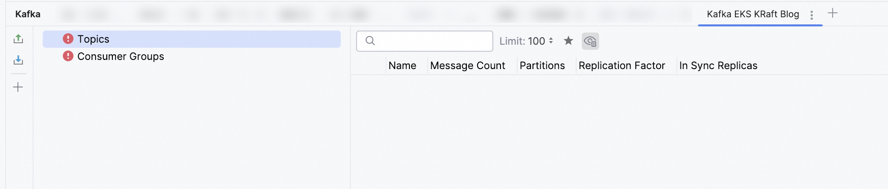

# Deploy Multi-Node Kafka Cluster on Kubernetes with KRaft Mode

In this comprehensive guide, we'll deploy a **production-ready 3-node Apache Kafka cluster** on Kubernetes using the new **KRaft mode** (Kafka Raft), eliminating the need for Zookeeper. This setup is perfect for testing and development environments with persistent storage and external connectivity.

## 🎯 What We'll Accomplish

- Deploy **Apache Kafka 4.0** with **KRaft mode** (no Zookeeper required)
- Set up **3-broker cluster** for high availability
- Configure **persistent storage** with XFS filesystem
- Enable **external connectivity** via port forwarding
- Test the setup with **IntelliJ IDEA Big Data Tools**

## 🏗️ Architecture Overview

Our Kafka deployment consists of:

- **3 Kafka brokers** acting as both brokers and controllers
- **Persistent Volume Claims** with XFS filesystem for better performance
- **Headless service** for internal cluster communication
- **Port forwarding** for external access from local development tools



**Important:**

This setup is designed for **testing and development environments**. For production deployments, you should implement proper authentication, encryption, network policies, and monitoring solutions.



## 📋 Prerequisites



**Prerequisites:**

- Kubernetes cluster (we're using AWS EKS)
- `kubectl` configured to access your cluster
- Sufficient resources (each broker: 1GB RAM, 500m CPU, 10Gi storage)
- Basic understanding of Kubernetes concepts



## 🚀 Step-by-Step Deployment

### Step 1: Create Dedicated Namespace

Let's start by creating a dedicated namespace for our Kafka cluster:

```shell
kubectl create namespace kafka-demo
```

```output
namespace/kafka-demo created
```

### Step 2: Configure Storage Class

Create a storage class optimized for Kafka with XFS filesystem:

```yaml
# kafka-storageclass-xfs.yaml
apiVersion: storage.k8s.io/v1
kind: StorageClass
metadata:
  name: kafka-xfs-sc
provisioner: ebs.csi.aws.com
parameters:
  type: gp3
  csi.storage.k8s.io/fstype: xfs  # XFS doesn't create lost+found
reclaimPolicy: Delete
volumeBindingMode: WaitForFirstConsumer
allowVolumeExpansion: true
```

Apply the storage class:

```shell
kubectl apply -f kafka-storageclass-xfs.yaml
```



**Note:**

StorageClass is a cluster-wide resource. If you already have this storage class in your cluster, you'll see a message like `storageclass.storage.k8s.io/kafka-xfs-sc unchanged`.



### Step 3: Create Persistent Volume Claims

Create dedicated PVCs for each Kafka broker:

```yaml
# kafka-pvcs-3node-xfs.yaml
apiVersion: v1
kind: PersistentVolumeClaim
metadata:
  name: kafka-pvc-0
  namespace: kafka-demo
spec:
  accessModes:
    - ReadWriteOnce
  storageClassName: kafka-xfs-sc
  resources:
    requests:
      storage: 10Gi
---
apiVersion: v1
kind: PersistentVolumeClaim
metadata:
  name: kafka-pvc-1
  namespace: kafka-demo
spec:
  accessModes:
    - ReadWriteOnce
  storageClassName: kafka-xfs-sc
  resources:
    requests:
      storage: 10Gi
---
apiVersion: v1
kind: PersistentVolumeClaim
metadata:
  name: kafka-pvc-2
  namespace: kafka-demo
spec:
  accessModes:
    - ReadWriteOnce
  storageClassName: kafka-xfs-sc
  resources:
    requests:
      storage: 10Gi
```

Apply the PVCs:

```shell
kubectl apply -f kafka-pvcs-3node-xfs.yaml -n kafka-demo
```

```output
persistentvolumeclaim/kafka-pvc-0 created
persistentvolumeclaim/kafka-pvc-1 created
persistentvolumeclaim/kafka-pvc-2 created
```

### Step 4: Create Headless Service

The headless service enables StatefulSet-like behavior for our brokers:

```yaml
# kraft-service-dual-3node.yaml
apiVersion: v1
kind: Service
metadata:
  name: kafka-service
  namespace: kafka-demo
spec:
  clusterIP: None  # Headless service for StatefulSet
  selector:
    app: kafka
  ports:
    - name: kafka-internal
      protocol: TCP
      port: 9092
      targetPort: 9092
    - name: controller
      protocol: TCP
      port: 9093
      targetPort: 9093
    - name: kafka-external
      protocol: TCP
      port: 9094
      targetPort: 9094
```

Apply the service:

```shell
kubectl apply -f kraft-service-dual-3node.yaml -n kafka-demo
```

```output
service/kafka-service created
```

### Step 5: Deploy Kafka Brokers

Now for the main deployment - three Kafka brokers configured with KRaft mode:

```yaml
# kafka-3-brokers-optimized.yaml
# External-Ready Kafka Cluster with XFS - 3 Brokers

# Kafka Broker 0
apiVersion: apps/v1
kind: Deployment
metadata:
  name: kafka-0
  namespace: kafka-demo
spec:
  replicas: 1
  selector:
    matchLabels:
      app: kafka
      instance: kafka-0
  template:
    metadata:
      labels:
        app: kafka
        instance: kafka-0
    spec:
      hostname: kafka-0
      subdomain: kafka-service
      securityContext:
        runAsUser: 1000
        runAsGroup: 1000
        fsGroup: 1000
      containers:
        - name: kafka
          image: apache/kafka:latest
          ports:
            - containerPort: 9092
              name: kafka-internal
            - containerPort: 9093
              name: controller
            - containerPort: 9094
              name: kafka-external
          volumeMounts:
            - name: kafka-storage
              mountPath: /var/lib/kafka/data
          env:
            - name: KAFKA_PROCESS_ROLES
              value: "broker,controller"
            - name: KAFKA_CONTROLLER_LISTENER_NAMES
              value: "CONTROLLER"
            - name: KAFKA_LISTENERS
              value: "INTERNAL://:9092,EXTERNAL://:9094,CONTROLLER://:9093"
            - name: KAFKA_LISTENER_SECURITY_PROTOCOL_MAP
              value: "INTERNAL:PLAINTEXT,EXTERNAL:PLAINTEXT,CONTROLLER:PLAINTEXT"
            - name: KAFKA_INTER_BROKER_LISTENER_NAME
              value: "INTERNAL"
            - name: KAFKA_CONTROLLER_QUORUM_VOTERS
              value: "1@kafka-0.kafka-service:9093,2@kafka-1.kafka-service:9093,3@kafka-2.kafka-service:9093"
            - name: KAFKA_NODE_ID
              value: "1"
            - name: KAFKA_ADVERTISED_LISTENERS
              value: "INTERNAL://kafka-0.kafka-service:9092,EXTERNAL://localhost:19092"
            - name: KAFKA_LOG_DIRS
              value: "/var/lib/kafka/data"
            # Memory optimization settings
            - name: KAFKA_HEAP_OPTS
              value: "-Xmx512m -Xms512m"
            - name: KAFKA_JVM_PERFORMANCE_OPTS
              value: "-server -XX:+UseG1GC -XX:MaxGCPauseMillis=20 -XX:InitiatingHeapOccupancyPercent=35"
          resources:
            requests:
              memory: "768Mi"
              cpu: "200m"
            limits:
              memory: "1Gi"
              cpu: "500m"
      volumes:
        - name: kafka-storage
          persistentVolumeClaim:
            claimName: kafka-pvc-0
---
# Kafka Broker 1
apiVersion: apps/v1
kind: Deployment
metadata:
  name: kafka-1
  namespace: kafka-demo
spec:
  replicas: 1
  selector:
    matchLabels:
      app: kafka
      instance: kafka-1
  template:
    metadata:
      labels:
        app: kafka
        instance: kafka-1
    spec:
      hostname: kafka-1
      subdomain: kafka-service
      securityContext:
        runAsUser: 1000
        runAsGroup: 1000
        fsGroup: 1000
      containers:
        - name: kafka
          image: apache/kafka:latest
          ports:
            - containerPort: 9092
              name: kafka-internal
            - containerPort: 9093
              name: controller
            - containerPort: 9094
              name: kafka-external
          volumeMounts:
            - name: kafka-storage
              mountPath: /var/lib/kafka/data
          env:
            - name: KAFKA_PROCESS_ROLES
              value: "broker,controller"
            - name: KAFKA_CONTROLLER_LISTENER_NAMES
              value: "CONTROLLER"
            - name: KAFKA_LISTENERS
              value: "INTERNAL://:9092,EXTERNAL://:9094,CONTROLLER://:9093"
            - name: KAFKA_LISTENER_SECURITY_PROTOCOL_MAP
              value: "INTERNAL:PLAINTEXT,EXTERNAL:PLAINTEXT,CONTROLLER:PLAINTEXT"
            - name: KAFKA_INTER_BROKER_LISTENER_NAME
              value: "INTERNAL"
            - name: KAFKA_CONTROLLER_QUORUM_VOTERS
              value: "1@kafka-0.kafka-service:9093,2@kafka-1.kafka-service:9093,3@kafka-2.kafka-service:9093"
            - name: KAFKA_NODE_ID
              value: "2"
            - name: KAFKA_ADVERTISED_LISTENERS
              value: "INTERNAL://kafka-1.kafka-service:9092,EXTERNAL://localhost:19093"
            - name: KAFKA_LOG_DIRS
              value: "/var/lib/kafka/data"
            # Memory optimization settings
            - name: KAFKA_HEAP_OPTS
              value: "-Xmx512m -Xms512m"
            - name: KAFKA_JVM_PERFORMANCE_OPTS
              value: "-server -XX:+UseG1GC -XX:MaxGCPauseMillis=20 -XX:InitiatingHeapOccupancyPercent=35"
          resources:
            requests:
              memory: "768Mi"
              cpu: "200m"
            limits:
              memory: "1Gi"
              cpu: "500m"
      volumes:
        - name: kafka-storage
          persistentVolumeClaim:
            claimName: kafka-pvc-1
---
# Kafka Broker 2
apiVersion: apps/v1
kind: Deployment
metadata:
  name: kafka-2
  namespace: kafka-demo
spec:
  replicas: 1
  selector:
    matchLabels:
      app: kafka
      instance: kafka-2
  template:
    metadata:
      labels:
        app: kafka
        instance: kafka-2
    spec:
      hostname: kafka-2
      subdomain: kafka-service
      securityContext:
        runAsUser: 1000
        runAsGroup: 1000
        fsGroup: 1000
      containers:
        - name: kafka
          image: apache/kafka:latest
          ports:
            - containerPort: 9092
              name: kafka-internal
            - containerPort: 9093
              name: controller
            - containerPort: 9094
              name: kafka-external
          volumeMounts:
            - name: kafka-storage
              mountPath: /var/lib/kafka/data
          env:
            - name: KAFKA_PROCESS_ROLES
              value: "broker,controller"
            - name: KAFKA_CONTROLLER_LISTENER_NAMES
              value: "CONTROLLER"
            - name: KAFKA_LISTENERS
              value: "INTERNAL://:9092,EXTERNAL://:9094,CONTROLLER://:9093"
            - name: KAFKA_LISTENER_SECURITY_PROTOCOL_MAP
              value: "INTERNAL:PLAINTEXT,EXTERNAL:PLAINTEXT,CONTROLLER:PLAINTEXT"
            - name: KAFKA_INTER_BROKER_LISTENER_NAME
              value: "INTERNAL"
            - name: KAFKA_CONTROLLER_QUORUM_VOTERS
              value: "1@kafka-0.kafka-service:9093,2@kafka-1.kafka-service:9093,3@kafka-2.kafka-service:9093"
            - name: KAFKA_NODE_ID
              value: "3"
            - name: KAFKA_ADVERTISED_LISTENERS
              value: "INTERNAL://kafka-2.kafka-service:9092,EXTERNAL://localhost:19094"
            - name: KAFKA_LOG_DIRS
              value: "/var/lib/kafka/data"
            # Memory optimization settings
            - name: KAFKA_HEAP_OPTS
              value: "-Xmx512m -Xms512m"
            - name: KAFKA_JVM_PERFORMANCE_OPTS
              value: "-server -XX:+UseG1GC -XX:MaxGCPauseMillis=20 -XX:InitiatingHeapOccupancyPercent=35"
          resources:
            requests:
              memory: "768Mi"
              cpu: "200m"
            limits:
              memory: "1Gi"
              cpu: "500m"
      volumes:
        - name: kafka-storage
          persistentVolumeClaim:
            claimName: kafka-pvc-2
```

Deploy the brokers:

```shell
kubectl apply -f kafka-3-brokers-optimized.yaml -n kafka-demo
```

```output
deployment.apps/kafka-0 created
deployment.apps/kafka-1 created
deployment.apps/kafka-2 created
```

## 🔍 Verification and Monitoring

### Check Deployment Status

Monitor the deployment progress:

```shell
# Check all resources
kubectl get all -n kafka-demo
```

```output
NAME                           READY   STATUS    RESTARTS   AGE
pod/kafka-0-xxxxxxxxxx-xxxxx   1/1     Running   0          2m8s
pod/kafka-1-yyyyyyyyyy-yyyyy   1/1     Running   0          2m8s
pod/kafka-2-zzzzzzzzzz-zzzzz   1/1     Running   0          2m8s

NAME                    TYPE        CLUSTER-IP   EXTERNAL-IP   PORT(S)                      AGE
service/kafka-service   ClusterIP   None         <none>        9092/TCP,9093/TCP,9094/TCP   3m53s

NAME                      READY   UP-TO-DATE   AVAILABLE   AGE
deployment.apps/kafka-0   1/1     1            1           2m8s
deployment.apps/kafka-1   1/1     1            1           2m8s
deployment.apps/kafka-2   1/1     1            1           2m8s

NAME                                 DESIRED   CURRENT   READY   AGE
replicaset.apps/kafka-0-xxxxxxxxxx   1         1         1       2m8s
replicaset.apps/kafka-1-yyyyyyyyyy   1         1         1       2m8s
replicaset.apps/kafka-2-zzzzzzzzzz   1         1         1       2m8s
```

```shell
# Check PVC status
kubectl get pvc -n kafka-demo
```

```output
NAME          STATUS   VOLUME                                     CAPACITY   ACCESS MODES   STORAGECLASS   VOLUMEATTRIBUTESCLASS   AGE
kafka-pvc-0   Bound    pvc-xxxxxxxx-xxxx-xxxx-xxxx-xxxxxxxxxxxx   10Gi       RWO            kafka-xfs-sc   <unset>                 4m4s
kafka-pvc-1   Bound    pvc-yyyyyyyy-yyyy-yyyy-yyyy-yyyyyyyyyyyy   10Gi       RWO            kafka-xfs-sc   <unset>                 4m3s
kafka-pvc-2   Bound    pvc-zzzzzzzz-zzzz-zzzz-zzzz-zzzzzzzzzzzz   10Gi       RWO            kafka-xfs-sc   <unset>                 4m3s
```

```shell
# Check pod logs to verify Kafka is healthy
kubectl logs -n kafka-demo deployment/kafka-0 --tail=10
```

```output
[2025-11-30 13:48:20,326] INFO Awaiting socket connections on 0.0.0.0:9092. (kafka.network.DataPlaneAcceptor)
[2025-11-30 13:48:20,339] INFO [BrokerServer id=1] Waiting for all of the authorizer futures to be completed (kafka.server.BrokerServer)
[2025-11-30 13:48:20,343] INFO [BrokerServer id=1] Finished waiting for all of the authorizer futures to be completed (kafka.server.BrokerServer)
[2025-11-30 13:48:20,344] INFO [BrokerServer id=1] Waiting for all of the SocketServer Acceptors to be started (kafka.server.BrokerServer)
[2025-11-30 13:48:20,344] INFO [BrokerServer id=1] Finished waiting for all of the SocketServer Acceptors to be started (kafka.server.BrokerServer)
[2025-11-30 13:48:20,344] INFO [BrokerServer id=1] Transition from STARTING to STARTED (kafka.server.BrokerServer)
[2025-11-30 13:48:20,345] INFO Kafka version: 4.0.0 (org.apache.kafka.common.utils.AppInfoParser)
[2025-11-30 13:48:20,345] INFO Kafka commitId: 985bc99521dd22bb (org.apache.kafka.common.utils.AppInfoParser)
[2025-11-30 13:48:20,345] INFO Kafka startTimeMs: 1764510500344 (org.apache.kafka.common.utils.AppInfoParser)
[2025-11-30 13:48:20,410] INFO [KafkaRaftServer nodeId=1] Kafka Server started (kafka.server.KafkaRaftServer)
```

All pods should show as `Running` and PVCs as `Bound`. The logs confirm Kafka 4.0.0 is running with KRaft mode successfully.

## 🔌 External Connectivity Setup

To connect from your local machine, set up port forwarding for each broker:

```shell
# Get pod names first
kubectl get pods -n kafka-demo
```

```output
NAME                       READY   STATUS    RESTARTS   AGE
kafka-0-xxxxxxxxxx-xxxxx   1/1     Running   0          2m8s
kafka-1-yyyyyyyyyy-yyyyy   1/1     Running   0          2m8s
kafka-2-zzzzzzzzzz-zzzzz   1/1     Running   0          2m8s
```

```shell
# Set up port forwarding (replace pod names with actual ones from your output)
kubectl port-forward kafka-0-xxxxxxxxxx-xxxxx -n kafka-demo 19092:9094 > /dev/null 2>&1 &
kubectl port-forward kafka-1-yyyyyyyyyy-yyyyy -n kafka-demo 19093:9094 > /dev/null 2>&1 &
kubectl port-forward kafka-2-zzzzzzzzzz-zzzzz -n kafka-demo 19094:9094 > /dev/null 2>&1 &
```

```output
[1] 12345
[2] 12346
[3] 12347
```

```shell
# Verify port forwards are running
jobs
```

```output
[1]    running    kubectl port-forward kafka-0-xxxxxxxxxx-xxxxx -n kafka-demo 19092:9094 >  2>&
[2]  - running    kubectl port-forward kafka-1-yyyyyyyyyy-yyyyy -n kafka-demo 19093:9094 >  2>&
[3]  + running    kubectl port-forward kafka-2-zzzzzzzzzz-zzzzz -n kafka-demo 19094:9094 >  2>&
```

## 🛠️ Testing with IntelliJ IDEA Big Data Tools

IntelliJ IDEA Ultimate provides excellent Big Data Tools support, including a powerful Kafka plugin that offers a unified UI for managing Kafka clusters. This plugin is particularly valuable for development and testing as it provides intuitive graphical interfaces for topic management, message production/consumption, and cluster monitoring without requiring command-line tools.



**Pro Tip:**

IntelliJ IDEA's Kafka tool (available in Ultimate edition) provides an excellent GUI for managing your Kafka cluster during development. You can create topics, produce test messages, and consume data without writing any code - perfect for testing your deployment!



### Setting Up Kafka Connection

Follow these steps to connect IntelliJ IDEA to your Kafka cluster:

1. **Open Kafka Tool Window**: Navigate to `View → Tool Windows → Kafka`
2. **Create New Connection**: Click the "New Connection" button (+ icon)
3. **Configure Connection Parameters**:

   - **Name**: `Local Kafka K8s Cluster`
   - **Configuration source**: Select `Custom`
   - **Bootstrap servers**: `127.0.0.1:19092,127.0.0.1:19093,127.0.0.1:19094`
   - **Authentication**: Select `None` (since we're using plaintext for testing)



**Note:**

This setup requires **IntelliJ IDEA Ultimate** edition. The Big Data Tools plugin is not available in the Community edition.




<!-- TODO: Add screenshot of IntelliJ Kafka connection dialog here -->

4. **Test Connection**: Click "Test connection" to verify connectivity
5. **Save Configuration**: Click "OK" to save the connection

### Connection Details Explained

- **127.0.0.1:19092**: Maps to kafka-0 external port (9094)
- **127.0.0.1:19093**: Maps to kafka-1 external port (9094)
- **127.0.0.1:19094**: Maps to kafka-2 external port (9094)



**Important:**

Use ports **19092, 19093, 19094** for external connections, NOT 9092, 9093, 9094. The latter are internal cluster ports.



### Quick Connectivity Test

You can verify the port forwarding is working with a simple connectivity test:

```shell
# Test connectivity to all brokers
nc -zv localhost 19092 19093 19094
```

```output
Connection to localhost port 19092 [tcp/*] succeeded!
Connection to localhost port 19093 [tcp/*] succeeded! 
Connection to localhost port 19094 [tcp/*] succeeded!
```

### Testing the Setup

Once connected, you can:

- **View topics**: Browse existing topics in the cluster
- **Create topics**: Right-click to create new topics with custom configurations
- **Produce messages**: Send test messages to topics with custom headers and keys
- **Consume messages**: Read messages from topics with filtering and search capabilities
- **Monitor partitions**: View partition distribution across brokers and consumer lag
- **Schema management**: Handle Avro/JSON schemas if using Schema Registry



<!-- TODO: Add screenshot of IntelliJ Kafka tool window showing connected cluster -->

## 🏗️ Key Configuration Highlights

### KRaft Mode Benefits

- **No Zookeeper dependency**: Simplified architecture and reduced operational overhead
- **Better performance**: Faster metadata operations and improved scalability
- **Unified log**: Single log format for both data and metadata

### Storage Optimization

- **XFS filesystem**: Better performance for Kafka workloads compared to ext4
- **No lost+found directory**: Cleaner storage management
- **Volume expansion**: Ability to expand storage when needed

### Resource Optimization

- **Memory settings**: Optimized JVM heap settings for container environments
- **G1 garbage collector**: Better performance for low-latency applications
- **Resource limits**: Proper resource constraints for Kubernetes scheduling

## 🧹 Cleanup

When you're done testing, clean up the resources:

```shell
# Stop port forwards
pkill -f "kubectl port-forward"
```

```output
# Background jobs terminated
```

```shell
# Delete the namespace (this removes all resources)
kubectl delete namespace kafka-demo
```

```output
namespace "kafka-demo" deleted
```

```shell
# Optionally delete the storage class if not used elsewhere
kubectl delete storageclass kafka-xfs-sc
```

```output
storageclass.storage.k8s.io "kafka-xfs-sc" deleted
```



**Important:**

Deleting the namespace will remove all resources including persistent volumes and data. Make sure you've backed up any important data before running the cleanup commands.



## 🎯 Summary

We successfully deployed a **3-node Kafka cluster** on Kubernetes with:

- ✅ **Apache Kafka 4.0** with KRaft mode (no Zookeeper)
- ✅ **Persistent storage** with XFS filesystem
- ✅ **High availability** with 3 brokers/controllers
- ✅ **External connectivity** via port forwarding
- ✅ **IntelliJ IDEA integration** for easy testing and management
- ✅ **Production-ready configuration** with resource optimization

This setup provides an excellent foundation for **testing and development environments**. For production deployments, consider adding:

- Authentication and encryption (SASL/SSL)
- Network policies for security
- Monitoring with Prometheus/Grafana
- Automated backup strategies
- Helm charts for easier deployment management

---

*This deployment was tested on AWS EKS with Kubernetes 1.33. The configuration can be adapted for other Kubernetes distributions with minor modifications.*
